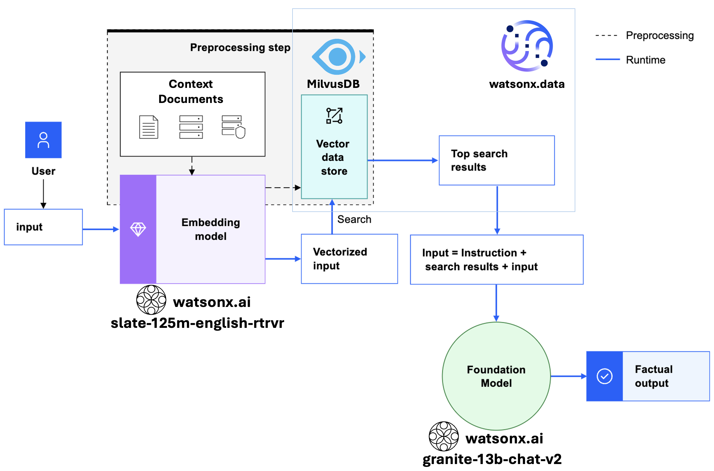

# Watsonx Embeddings Models RAG Demo

This demo uses the watsonx embeddings services API available to implement a RAG workflow. The embedding models that are available from watsonx.ai create text embeddings that capture the meaning of sentences or passages for use in your generative AI applications.

Converting text into text embeddings helps with document comparison, question-answering, and in retrieval-augmented generation (RAG) tasks, where you need to retrieve relevant content quickly.

Learn more about what are text embeddings [here](https://dataplatform.cloud.ibm.com/docs/content/wsj/analyze-data/fm-embed-overview.html?context=wx&audience=wdp#what-are-text-embeddings).

## Reference Architecture

For this demo, all the dependencies can be installed within the notebook, and the whole watsonx.ai is used to implement it.

The embeddings model used is the slate and the LLM is the Granite, both recently release this year (2024). And now, MilvusDB is available at watsonx.data, it can be connected to promptlab or through API, as it's done in this notebook demo. Milvus is a vector database that is designed for scalable similarity search.

Please, refer to [watsonx.data docs](https://cloud.ibm.com/docs/watsonxdata?topic=watsonxdata-getting-started) for instantiating and getting connection details. Note that also, a IAM key is needed to autenticate into the watsonx.ai APIs. Create your own API IAM key following the steps [in here](https://cloud.ibm.com/docs/account?topic=account-userapikey&interface=ui#userapikey).

LangChain is used in the preprocessing and chunking the text that is retrieved from the URL that is given containing the documents, as well as it's interface for instantiating the watsonx.ai Granite model. 
 
Then the chunks are converted into embeddings, using one of the [slate model's family](https://medium.com/@alex.lang/fair-is-fast-and-fast-is-fair-ibm-slate-foundation-models-for-nlp-3508412a4b04). It’s an encoder-only model similar to RoBERTa , with 153 million parameters, it was trained on a multilingual, uncased corpus of data. After that the embeddings are saved into MilvusDB instance at watsonx.data. Check the [other supported models](README.md#other-important-reference) for embeddings below.
 
When a new request/question for the LLM is received, a search is performed in the MilvusDB, to find the nearest embeddings to the text provided in the question. Then the most contextualized documents are retrieved to be used as base for the LLM, which in this case is on of the [Granite models](https://www.ibm.com/granite). Granite language models (7b open-source, 13B English, 20b multilingual, 8b Japanese) demonstrate high accuracy and throughput at low latency, while consuming only a fraction of GPU resources.

## Other important reference:

- [Watsonx API Reference for embeddings](https://cloud.ibm.com/apidocs/watsonx-ai#text-embeddings);
- [Supported embeddings models](https://dataplatform.cloud.ibm.com/docs/content/wsj/analyze-data/fm-models-embed.html?context=wx&audience=wdp#ibm-provided);
- [LangChain docs for watsonx.ai](https://python.langchain.com/v0.2/docs/integrations/text_embedding/ibm_watsonx/);
- [More about RAG technique](https://dataplatform.cloud.ibm.com/docs/content/wsj/analyze-data/fm-rag.html?context=wx&audience=wdp);
- [Milvus connection to watsonx.ai](https://dataplatform.cloud.ibm.com/docs/content/wsj/analyze-data/fm-prompt-data-index.html?context=wx&audience=wdp#setup-milvus).